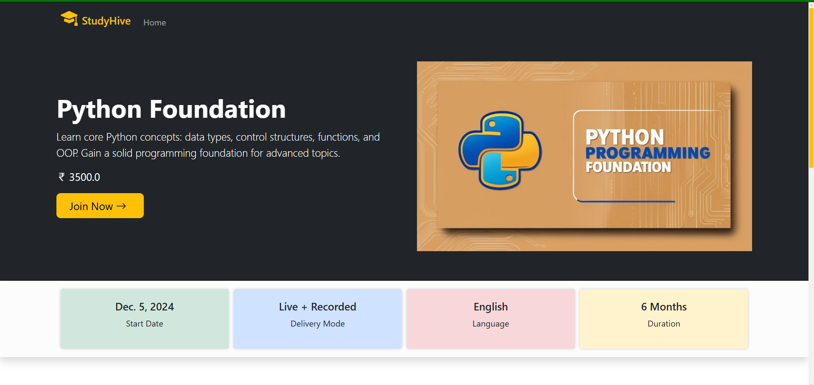
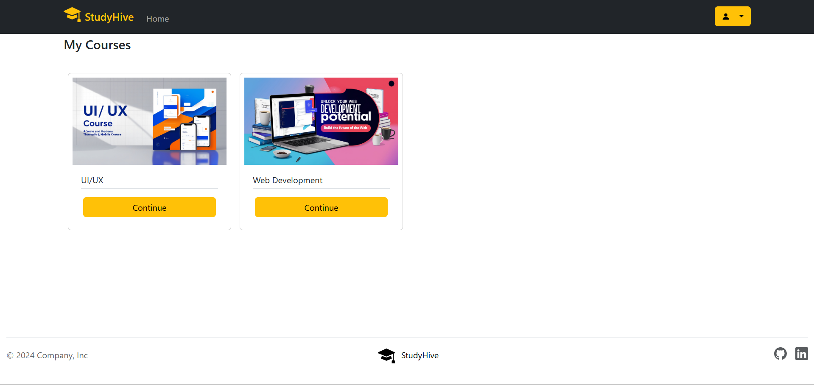
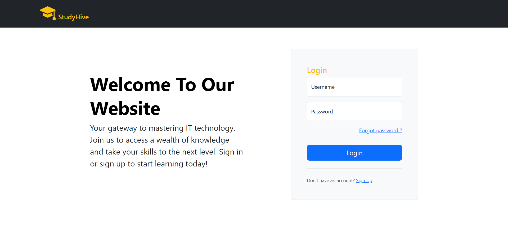

# StudyHive - Learning Management System (LMS)

**StudyHive** is a web-based Learning Management System (LMS) built with Django that allows users to access courses, track their learning progress, and manage queries related to the courses. This platform is designed for both students and instructors, offering a seamless environment for online learning and course management.

## Project Description

StudyHive aims to provide a user-friendly platform for online learning. Admins can add and manage courses, while students can enroll in courses, view their progress, and ask queries related to the course material. The platform also includes features like quiz management, course resources, and user authentication.

## Features

- User authentication for students and instructors
- Admin panel for managing courses, queries, and users
- Students can enroll in and access courses
- Course details with videos, quizzes, and assignments
- Query submission by students for course-related issues
- Responsive front-end for a smooth learning experience

## Tools & Technologies Used

- **Backend**: Django (Python Web Framework)
- **Frontend**: HTML, CSS, JavaScript (Bootstrap for responsive design)
- **Database**: SQLite (default) or PostgreSQL (recommended for production)
- **Authentication**: Django Authentication System
- **Version Control**: Git
- **Storage**: Media files (for images, videos, etc.)

## Requirements

Before setting up the project, ensure you have the following installed:

- Python 3.11.7
- pip (Python Package Installer)
- Git
- Django (latest stable version)
- Vs-Code or any other IDE 

## Installation Guide

Follow these steps to set up **StudyHive** on your local machine.

### 1. Clone the repository:

Clone the project to your local machine using Git:

git https://github.com/AjayKumar095/StudyHive_LMS_Project.git
cd studyhive

###  2. Create a virtual environment (optional but recommended):
    python3 -m venv venv
    source venv/bin/activate  # On Windows, use venv\Scripts\activate

###  3. Install dependencies:
    pip install -r requirements.txt

###  4. Run the Django app:
    python manage.py runserver

    The app will be accessible at http://127.0.0.1:8000/
---

Links & Resources:

- LinkedIn: [My LinkedIn Profile](https://www.linkedin.com/in/ajay-kumar-4b1b7329a/)

---

Images:

Here are some screenshots from the project:

---